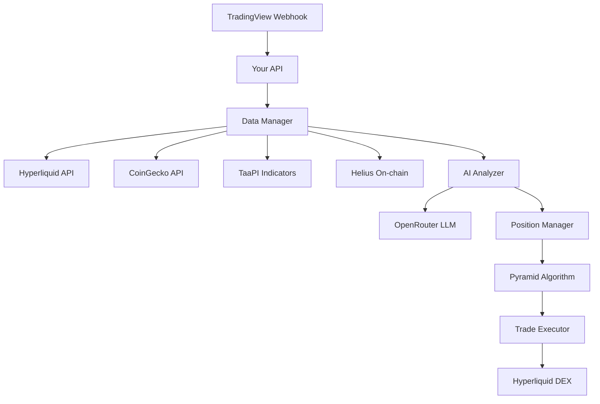

# Aggressive AI-Powered Trading Strategy

## 1. AGGRESSIVE PYRAMID POSITION MANAGEMENT

### Position Scaling Strategy (DCA + Pyramiding)
```javascript
// Configuration
const AGGRESSIVE_CONFIG = {
  // Capital allocation
  initialPosition: 30,        // 30% on first signal
  maxTotalPosition: 90,       // Up to 90% total capital
  pyramidSteps: [30, 25, 20, 15], // Decreasing add-ons

  // Leverage scaling
  leverageSteps: [3, 4, 5, 6],   // Increasing leverage per add
  maxCombinedLeverage: 10,       // Total exposure limit

  // Exit strategy
  partialExits: [25, 25, 25, 25], // Take 25% off at each sell
  shortFlipThreshold: 2,          // After 2 sells, flip to short
};

// Position building logic
class AggressivePositionManager {
  constructor() {
    this.positions = [];
    this.currentStep = 0;
    this.totalExposure = 0;
  }

  onBuySignal(signal) {
    if (this.currentStep < 4) {
      const size = AGGRESSIVE_CONFIG.pyramidSteps[this.currentStep];
      const leverage = AGGRESSIVE_CONFIG.leverageSteps[this.currentStep];

      this.addPosition({
        size: size,
        leverage: leverage,
        entry: signal.price,
        stop: signal.price * 0.95, // 5% stop per position
      });

      this.currentStep++;
    }
  }

  onSellSignal(signal) {
    if (this.positions.length > 0) {
      // Reduce position by 25%
      this.reducePosition(0.25);

      // If we've reduced 50%+, consider flipping short
      if (this.getReductionCount() >= 2) {
        this.flipToShort(signal);
      }
    }
  }
}
```

## 2. MARKET DATA SOURCES & ARCHITECTURE

### Option A: Real-Time Data Pipeline (BEST)
```javascript
// Multiple data sources for comprehensive analysis
const DATA_SOURCES = {
  // Price & Volume Data
  hyperliquid: {
    api: '@nktkas/hyperliquid',
    data: ['orderbook', 'trades', 'funding', 'oi']
  },

  // On-chain metrics (if trading SOL)
  helius: {
    api: 'YOUR_HELIUS_KEY',
    data: ['dex_volume', 'whale_movements', 'tvl_changes']
  },

  // Market data aggregator
  coingecko: {
    api: 'free',
    data: ['price', 'volume', 'market_cap', 'sentiment']
  },

  // Technical indicators
  taapi: {
    api: 'YOUR_TAAPI_KEY', // $9.99/month
    data: ['rsi', 'macd', 'bollinger', 'atr', 'adx']
  },

  // Social sentiment
  lunarcrush: {
    api: 'YOUR_LUNARCRUSH_KEY',
    data: ['social_volume', 'sentiment', 'influencer_mentions']
  }
};
```

### Option B: LLM-Powered Analysis Layer
```javascript
// OpenRouter Configuration (cheaper than OpenAI)
const AI_CONFIG = {
  provider: 'openrouter',
  model: 'anthropic/claude-3-haiku', // Fast & cheap
  apiKey: process.env.OPENROUTER_API_KEY,

  analysisPrompt: `
    Analyze market conditions for {symbol}:
    - Price: {price}, Change: {change}%
    - Volume: {volume}, OI: {openInterest}
    - Funding: {funding}, RSI: {rsi}
    - Recent news: {news}

    Return JSON:
    {
      "marketCondition": "bullish/bearish/neutral",
      "confidence": 0-100,
      "suggestedLeverage": 1-10,
      "suggestedSize": 10-90,
      "reasoning": "brief explanation"
    }
  `
};

// Implementation
async function getAIMarketAnalysis(marketData) {
  const response = await fetch('https://openrouter.ai/api/v1/chat/completions', {
    method: 'POST',
    headers: {
      'Authorization': `Bearer ${AI_CONFIG.apiKey}`,
      'Content-Type': 'application/json',
    },
    body: JSON.stringify({
      model: AI_CONFIG.model,
      messages: [{
        role: 'user',
        content: AI_CONFIG.analysisPrompt.replace(/{(\w+)}/g,
          (match, key) => marketData[key])
      }],
      temperature: 0.3, // Lower = more consistent
      response_format: { type: "json_object" }
    })
  });

  return JSON.parse(response.choices[0].message.content);
}
```

## 3. COMPLETE SYSTEM ARCHITECTURE



## 4. IMPLEMENTATION PLAN

### Step 1: Add Market Data Collection
```bash
# Install dependencies
npm install axios node-cron @openrouter/client

# Add to your API
apps/api/src/services/market-data.ts
apps/api/src/services/ai-analyzer.ts
apps/api/src/services/pyramid-manager.ts
```

### Step 2: Environment Variables for Railway
```env
# Data APIs
COINGECKO_API_KEY=free
TAAPI_API_KEY=your_key_here
HELIUS_API_KEY=your_existing_key
OPENROUTER_API_KEY=your_key_here

# Aggressive Trading Settings
ENABLE_PYRAMIDING=true
MAX_POSITION_PERCENT=90
ENABLE_SHORTING=true
USE_AI_ANALYSIS=true
AI_CONFIDENCE_THRESHOLD=70

# Risk Overrides
AGGRESSIVE_MODE=true
STOP_LOSS_PERCENT=10  # Wider stops for pyramiding
MAX_DRAWDOWN=40       # Higher tolerance
```

### Step 3: Enhanced Webhook Handler
```javascript
async function handleTradingViewSignal(signal) {
  // 1. Collect market data
  const marketData = await collectMarketData(signal.symbol);

  // 2. Get AI analysis
  const aiAnalysis = await getAIMarketAnalysis(marketData);

  // 3. Determine position action
  if (signal.action === 'buy') {
    if (aiAnalysis.confidence > 70) {
      // Aggressive entry
      await pyramidManager.addPosition({
        size: aiAnalysis.suggestedSize,
        leverage: aiAnalysis.suggestedLeverage,
        reason: aiAnalysis.reasoning
      });
    }
  } else if (signal.action === 'sell') {
    // Gradual exit or flip
    await pyramidManager.reduceOrFlip(signal);
  }

  // 4. Execute on Hyperliquid
  await executeTradeStack();
}
```

## 5. DATA SOURCES COMPARISON

| Source | Cost | Data Quality | Use Case |
|--------|------|-------------|----------|
| **Hyperliquid API** | Free | Excellent | Order book, funding, OI |
| **Helius** | $0-299/mo | Good | Solana on-chain only |
| **CoinGecko** | Free-$129 | Good | General market data |
| **TaaPI** | $9.99/mo | Excellent | Technical indicators |
| **OpenRouter** | $0.001/1k tokens | N/A | AI analysis |
| **Binance API** | Free | Excellent | Reference prices |

## 6. AGGRESSIVE SETTINGS EXPLAINED

### Why This Works:
1. **Pyramiding**: Adding to winners maximizes profitable trades
2. **Scaling Out**: Taking partial profits locks in gains
3. **AI Analysis**: Filters out low-confidence setups
4. **Multi-source Data**: Reduces false signals

### Risk Management:
- Total exposure capped at 90% (10% reserve)
- Individual position stops at 5-10%
- AI confidence threshold prevents overtrading
- Automatic deleveraging on drawdown

## 7. QUICK START IMPLEMENTATION

```javascript
// apps/api/src/services/aggressive-trader.ts
export class AggressiveTrader {
  constructor() {
    this.pyramidLevels = [0.30, 0.25, 0.20, 0.15];
    this.currentLevel = 0;
    this.positions = [];
  }

  async analyzeAndTrade(signal) {
    // Get market data
    const data = await this.fetchMarketData(signal.symbol);

    // AI decision (or rule-based if no API key)
    const decision = process.env.OPENROUTER_API_KEY
      ? await this.getAIDecision(data)
      : this.getRuleBasedDecision(data);

    // Execute based on confidence
    if (decision.confidence > 70) {
      await this.executePyramid(signal, decision);
    }
  }

  async executePyramid(signal, decision) {
    if (signal.action === 'buy' && this.currentLevel < 4) {
      // Add to position
      const size = this.pyramidLevels[this.currentLevel];
      await this.openPosition({
        size: size * 100, // Percentage of account
        leverage: 3 + this.currentLevel, // 3x, 4x, 5x, 6x
        symbol: signal.symbol
      });
      this.currentLevel++;
    } else if (signal.action === 'sell') {
      // Reduce by 25% or flip to short
      await this.reducePosition(0.25);
      if (this.currentLevel === 0 && decision.marketCondition === 'bearish') {
        await this.openShort(signal);
      }
    }
  }
}
```

## 8. COSTS & RECOMMENDATIONS

### Minimal Setup ($10/month):
- TaaPI for indicators: $9.99
- OpenRouter: ~$0.50/month for AI
- Everything else: Free tier

### Optimal Setup ($50/month):
- TaaPI Pro: $29.99
- OpenRouter: $10
- CoinGecko Pro: $10

### Data You Actually Need:
1. **Price & Volume**: Hyperliquid API (free)
2. **Technical Indicators**: TaaPI or calculate yourself
3. **Market Sentiment**: Optional but helpful
4. **AI Analysis**: Start without it, add later

## 9. WITHOUT LLM - RULE-BASED AGGRESSIVE SYSTEM

```javascript
function getRuleBasedDecision(marketData) {
  let confidence = 50;

  // Trend alignment
  if (marketData.price > marketData.ma20) confidence += 15;
  if (marketData.price > marketData.ma50) confidence += 10;

  // Momentum
  if (marketData.rsi > 50 && marketData.rsi < 70) confidence += 15;
  if (marketData.macd > marketData.signal) confidence += 10;

  // Volume
  if (marketData.volume > marketData.avgVolume * 1.5) confidence += 10;

  // Volatility (inverse)
  if (marketData.atr < marketData.avgAtr) confidence += 10;

  return {
    confidence,
    suggestedSize: Math.min(90, confidence * 0.9),
    suggestedLeverage: Math.min(6, Math.floor(confidence / 20)),
    marketCondition: confidence > 60 ? 'bullish' : 'neutral'
  };
}
```

## NEXT STEPS:
1. Do you want AI-powered analysis or rule-based?
2. Which data sources do you want to pay for?
3. Should we implement pyramiding first or market analysis?
4. What's your risk tolerance for 90% capital usage?